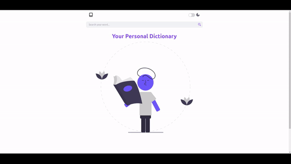

    
  <h1>Dictionary 🏆</h1>

### A English dictionary Web Application

## Live Link 🚀

🔗 https://dictonary-app.vercel.app/

## About

- A English dictionary web application where user search the words and he will get the meaning of that word also synonyms and antonyms of that word and audio pronunciation of word.
- user can play the audio and listen correct pronunciation of words.

## 🛠 Technologies used

- ReactJs
- Tailwind CSS
- [Free dictionary api](https://dictionaryapi.dev/)

## 👨‍💻 Features

- user can Search words.
- Get meaning of word on click Enter Button or click on search icon.
- Has Light and Dark mode.
- user can listen correct pronunciation of word click on play button.

## 📸 Screenshots

## 🤝🏻 Connect With Me

